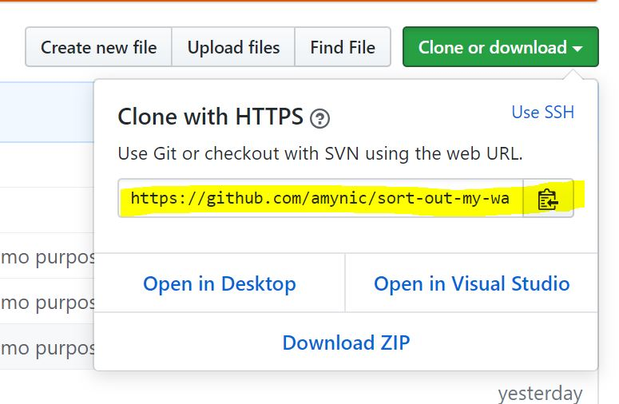
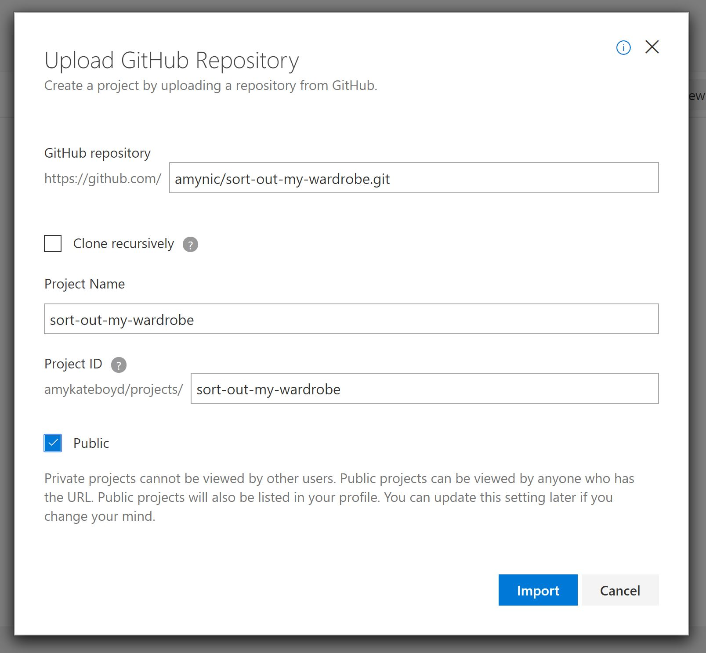
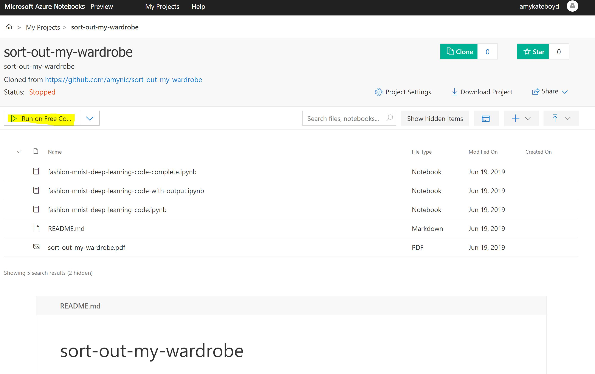
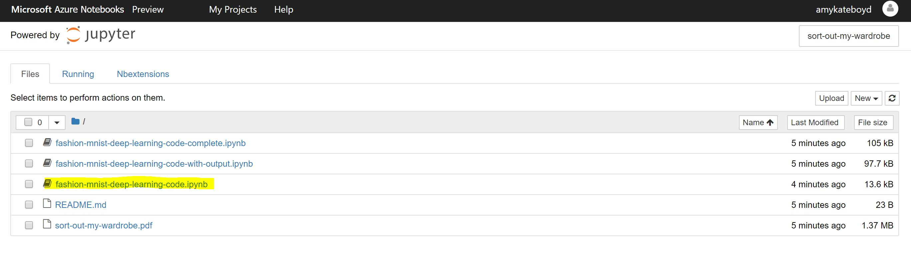
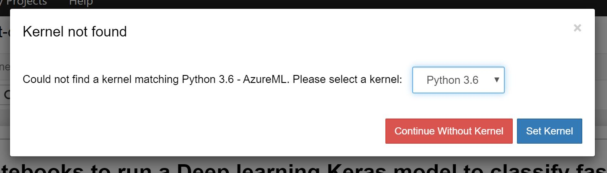

# sort-out-my-wardrobe
# Image Classification using Deep Learning

This github repository contains code files and instructions for running a [Keras Deep Learning Image Classification experiment](https://keras.io/) on [Zalando Fashion MNIST dataset](https://github.com/zalandoresearch/fashion-mnist).

## Content Available

* **Code files**
    * **[fashion-mnist-deep-learning-code.ipynb](code\fashion-mnist-deep-learning-code.ipynb)**
        * This file is a simple python notebooks with the basic code to create an image classification deep learning model using Keras. The idea is for this notebook to be built on to learn more about the Keras framework and deep learning
    * **[fashion-mnist-deep-learning-code-complete.ipynb](code\fashion-mnist-deep-learning-code-complete.ipynb)**
        * This is a file with all the code to run this image classification model as well as some changes made to the algorithm in order to try and gain further accuracy for the model. See this file for changes and edits I have made to the Keras sequential model
    * **[fashion-mnist-deep-learning-code-with-output.ipynb](code\fashion-mnist-deep-learning-code-with-output.ipynb)**
        * This file is simply for demo purposes. If you do not have time to run through the experiment but wish to see the code output from a previous run this is available
* **Other files**
    * **[sort-out-my-wardrobe.pdf](sort-out-my-wardrobe.pdf)**
        * This is the PDF version of the session slides I used when delivering this workshop
    * **README .md file**
        * A file containing instructions on how to get started with the code

## How to Run

1. I have used [Azure Notebooks](https://notebooks.azure.com/) as an easy and simple way to access Jupyter Notebooks within a web browser
2. Navigate to: [https://notebooks.azure.com/](https://notebooks.azure.com/)
3. Sign in using your Azure Subscription credentials. If you do not have an Azure Subscription - sign up here: [https://azure.microsoft.com/en-gb/free/](https://azure.microsoft.com/en-gb/free/)
4. Once on your account page, select **'My Projects'** in the top toolbar
5. Then select the button **'Upload Github Repo'**
6. Copy this repository URL to clone: [https://github.com/amynic/sort-out-my-wardrobe.git](https://github.com/amynic/sort-out-my-wardrobe.git)

7. Complete the information below:
    * **GitHub Repository:** paste the link above
    * **Project name:** will propagate automatically but feel free to edit
    * **Project ID:** will propagate automatically but feel free to edit
    * Select **Public** Checkbox
    * 
8. This may take a moment ...
9. Once loaded select **'Run on Free Compute'**

10. Select the Python Notebook you wish to run - I recommend starting with **fashion-mnist-deep-learning-code.ipynb'**

11. Now the notebook will open in a new tab. Please select the latest version of python and select **'Set Kernel'** - I recommend Python 3.6

12. Now you are ready to run through the notebook. Run each code cell one at a time by selecting **'CTRL + Enter'** on your keyboard and review the output (if there is python output for that cell)
13. The notes within the Notebook will help guide you regarding what the code is doing and the results should explain what happened once the code is run. 

> ### Now its over to you! 
> ### Use this notebook to build upon and experiment with Keras deep learning API

## How to Contribute

* If you **find errors or mistakes** within the instructions or code in this repo please add an issue or a pull request

* If you wish to contribute more **sample code/instructions** which could help others learn about Deep Learning and Image Classification please submit a pull request or get in contact: 
    * Twitter: [@AmyKateNicho](https://twitter.com/AmyKateNicho)
    * LinkedIn: [Amy Kate Boyd](https://www.linkedin.com/in/amykatenicho/)
